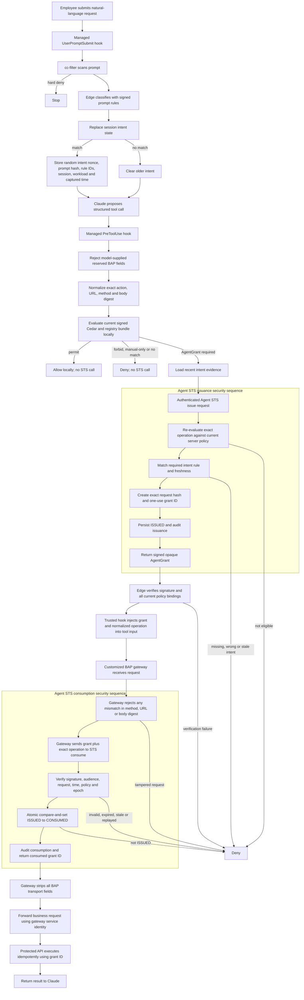

# AgentGrant and Agent STS

## What this adds

AgentGrant is the escalation path between ordinary local authorization and a
protected company API. BAP Edge still permits ordinary developer operations
locally. Explicit forbids and manual-only clients still deny locally. Only a
signed-policy result of `AGENT_GRANT_REQUIRED` calls Agent STS.

An AgentGrant is an opaque, Ed25519-signed, short-lived, single-use capability.
It is bound to the exact normalized operation, intent classification, Edge and
workload, Claude session and tool-use ID, audience, policy version and digest,
revocation epoch, issue time, and expiry. It is not A2P and does not replace the
employee's production-access process.

## Complete activity and transaction flow



The two boxes are security sequences. With `BAP_DATABASE_DSN`, Agent STS
stores grant state in MySQL and performs `ISSUED -> CONSUMED` as one conditional
atomic update, so only one gateway replica succeeds. No-database local mode uses
a mutex-protected in-memory ledger and is labeled development-only at startup.
Issuance also increments the signed `max_grants_per_intent` budget and inserts
the grant in one MySQL transaction; the privacy-safe key binds principal, Edge,
session, workload, and the random intent nonce. The database compare-and-set is
the one-use transaction boundary. Audit append
is a subsequent fail-closed step: if it fails, issuance is not returned or the
gateway does not call the protected API. An orphaned issued/consumed row then
expires or remains as security evidence; it never becomes a second execution.

## Trust and token transport

Claude creates only the business input: `method`, `url`, and optional JSON
`body`. The managed Edge rejects `_bap_agent_grant` or `_bap_operation` if the
model supplies either field. After successful issuance, the trusted
`PreToolUse` hook uses `updatedInput` to inject both fields. The customized
gateway consumes and removes them before forwarding. The token is never put in
the prompt or system context and is never used as a shell argument.

The example signed rule is intentionally narrow:

- tool: `mcp__bap_gateway__execute`;
- action: `gateway.execute`;
- method: `POST`;
- host: `api.staging.company.example`;
- exact path: `/orders/deploy`;
- required intent: orders + staging + deploy/release/rollout;
- RFC 8707 resource and token audience:
  `https://api.staging.company.example/orders/deploy`;
- maximum lifetime: 60 seconds;
- maximum age of matching intent evidence: 300 seconds;
- maximum uses: one.

## Strict resource indicators

BAP applies a mandatory, single-resource profile of
[RFC 8707](https://www.rfc-editor.org/rfc/rfc8707.html) to its custom Agent STS
protocol. Signed policy assigns one HTTPS `resource` URI to each AgentGrant
rule. Edge derives the issue parameter from that policy rather than model
input. The issued token's `aud` and `resource` claims must both equal the URI.
The API or MCP PEP repeats its independently configured URI when consuming the
grant, and its authenticated STS identity must be allowed for that URI.

Missing, malformed, non-HTTPS, query-bearing, fragment-bearing, unknown, or
mismatched values fail with `invalid_target` before grant reservation or the
atomic consume transition. The resource URI identifies one protected API or
MCP server; the separate operation hash continues to bind the exact method,
path/tool, and parameters.

BAP does not expose a separate OAuth authorization endpoint. Its issue endpoint
combines authorization and token issuance, and both issue and consume mandate
the resource parameter. If a standard OAuth authorization endpoint is added,
it must apply the same validator and policy mapping.

The example gateway enforcement core is in
`bap-service/internal/agentgateway`. It is the behavior that a Spring Cloud
Gateway filter must preserve: validate the business envelope, call
`POST /bap/v1/agent-sts/consume`, require a successful atomic consumption,
strip BAP fields, then forward with a gateway-owned service identity and the
grant ID as an idempotency key.

## Prove AgentGrant works on a company Windows laptop

This is the recommended native acceptance test. It uses the installed Go
toolchain and Windows executables only; it does not require Docker, Podman, a
Claude subscription/API key, or the company Claude wrapper. Run it from an
ordinary PowerShell window at the repository root:

```powershell
cd C:\path\to\bap-system
.\Build-Bap.ps1 -Runtime Native
.\Test-AgentGrant.ps1 -Runtime Native
.\Start-BapNativeLocal.ps1 -VerifyOnly -Port 18443
```

For a one-command rebuild and live acceptance test, use:

```powershell
.\Start-BapNativeLocal.ps1 -VerifyOnly -Rebuild -Port 18443
```

`-VerifyOnly` is intentionally allowed when company managed hooks are already
installed. It starts a temporary native BAP Service on localhost, drives the
native Edge directly, restores any project-local Claude settings, and stops
the temporary service. Port `18443` avoids a company service already using
`8443`; choose another unused local port if necessary.

The test must print all of these lines:

```text
PASS: signed prompt intent -> exact gateway operation -> Agent STS -> trusted one-use grant injection
PASS: live Agent STS consume -> HTTP 200
PASS: exact AgentGrant replay -> HTTP 403
PASS: signed audit -> AGENT_GRANT_ISSUED + AGENT_GRANT_CONSUMED
PASS: native BAP Service, signed policy synchronization, Edge policy, AgentGrant issue/consume/replay, audit, and local hook settings merge.
```

These prove, respectively, that Edge bound classified user intent to the exact
approved operation and obtained a signed short-lived grant; the live STS
accepted that grant once; the same grant could not be reused; and both state
transitions entered the signed audit chain. The bearer grant is not printed or
placed in a process argument. Its temporary request file is deleted by the
test. The retained run directory shown at the end contains logs, keys, policy
state, and the signed audit—not the temporary bearer-token file.

`Test-AgentGrant.ps1` supplies the deeper negative suite: missing, malformed,
query-bearing, and cross-resource indicators; wrong/stale intent; wrong PEP
identity; host/path/method or body tampering; policy digest/version and
revocation-epoch changes; expiry; replay; reserved-field injection; and proof
that the example gateway does not invoke its backend before atomic consume.
The live native test exercises Edge plus the real STS HTTP endpoint; gateway
forwarding remains an integration test until the managed Spring Cloud Gateway
filter/MCP transport is deployed.

## Build and test commands

Run from the repository root:

```powershell
# Default: Agent STS is embedded in the BAP Service artifact
.\Build-Bap.ps1 -Runtime Native

# Opt in to an additional STS-only Windows executable
.\Build-BapService-Native.ps1 -Target Windows -SeparateAgentSTS

# Cross-compile combined Service and STS-only Linux artifacts
.\Build-BapService-Native.ps1 -Target Linux -Architecture amd64 -SeparateAgentSTS

# Build combined and STS-only OCI images with either engine
.\Build-BapService.ps1 -Runtime Docker -SeparateAgentSTS
.\Build-BapService.ps1 -Runtime Podman -SeparateAgentSTS

# Fastest on a company Windows laptop with approved Go
.\Test-AgentGrant.ps1 -Runtime Native

# Equivalent container test
.\Test-AgentGrant.ps1 -Runtime Docker
.\Test-AgentGrant.ps1 -Runtime Podman

# Prefer native Go when installed; otherwise select a working container engine
.\Test-AgentGrant.ps1 -Runtime Auto

# CMD one-click wrapper accepts the same arguments
.\Test-AgentGrant.bat -Runtime Native

# Complete native certification also includes every AgentGrant test
.\Test-MVP0.ps1 -Runtime Native
```

The focused suite proves token signature and lifetime validation, intent and
policy binding, exact request binding, replay denial, reserved-field rejection,
gateway tamper rejection, and that the backend runs only after consumption.

Without `-SeparateAgentSTS`, the normal `bap-service` exposes policy sync,
audit, and Agent STS APIs. With the switch, that artifact is still produced and
an additional `bap-agent-sts` artifact is built with the default runtime role
`agent-sts`. The STS-only role exposes health, readiness, metrics, issue, and
consume endpoints; it does not expose policy sync or general evaluation APIs.
`BAP_SERVICE_ROLE=combined|agent-sts` can override the compiled default for
controlled deployment testing.

## Separate-service security configuration

The STS-only role uses two non-interchangeable client identities:

| Caller | Endpoint | Bearer development variables | Production mTLS identity |
|---|---|---|---|
| Managed BAP Edge | `POST /bap/v1/agent-sts/issue` | `BAP_AGENT_STS_EDGE_API_KEY`, principal `BAP_AGENT_STS_EDGE_PRINCIPAL` | certificate Common Name must equal the configured Edge principal |
| BAP gateway | `POST /bap/v1/agent-sts/consume` | `BAP_AGENT_STS_GATEWAY_API_KEY`, principal `BAP_AGENT_STS_GATEWAY_PRINCIPAL` | certificate Common Name must equal the configured gateway principal |

The service rejects identical Edge and gateway principals. A gateway
credential cannot issue and an Edge credential cannot consume. Off-loopback
deployment uses HTTPS; the STS-only role refuses cleartext startup and requires
TLS 1.3. Configure `BAP_CLIENT_CA_PATH` to require and verify
client certificates. Use separate certificates and private keys for Edge and
gateway, short certificate lifetimes, automated rotation, and a private DNS
name whose SAN is validated by each client. Network policy should permit only
managed Edge egress to `/issue` and gateway egress to `/consume`.

For a separate Edge channel, configure:

```yaml
service_url: "https://bap-policy.company.example"
agent_sts_url: "https://agent-sts.company.example"
agent_sts_issuer: "bap-agent-sts-prod"
api_key_env: "BAP_EDGE_API_KEY"
agent_sts_api_key_env: "BAP_AGENT_STS_EDGE_API_KEY"
```

The STS-only process receives the AgentGrant signing private key and audit
credentials. It does **not** load the policy-bundle signing private key. It
loads `BAP_ACTIVE_POLICY_BUNDLE_PATH`, verifies that signed bundle with
`BAP_BUNDLE_PUBLIC_KEY_PATH`, and refuses startup if it is missing, invalid, or
expired. In production, mount the AgentGrant signing key from KMS/HSM-backed
secret delivery, mount the bundle public key read-only, and deliver approved
signed bundles through a protected rollout mechanism.

Business eligibility is not compiled into Go. `agent_grant_rules` in the
signed bundle carry the tool, normalized action, methods, exact hosts, exact
paths, required intent-rule IDs, audience, grant TTL, intent freshness,
profiles, owner, and approval. Add another scenario by publishing another
reviewed rule and incrementing the bundle version. `BAP_AGENT_STS_ISSUER`
configures the deployment issuer. The fixed gateway tool name is the managed
transport protocol contract shared by Edge and gateway, not a business-policy
exception.

Bearer keys exist for local development and controlled pilots. Production
should use mTLS workload identities, keep bearer variables unset, authorize
certificate principals per endpoint, rate-limit issue and consume separately,
and alert on authentication failures, issuance denials, replay attempts,
expiry spikes, and policy-digest mismatches. Never log an AgentGrant token.

## Current reference boundary

Implemented now: policy schema, prompt intent replacement, gateway operation
normalization, STS issuance and consumption endpoints, signed one-use claims,
Edge verification and trusted injection, gateway enforcement core, audit
fields, and automated tests.

Before production: deploy Agent STS as a separate, narrowly exposed service
within the BAP product; require the transactional MySQL ledger; give Edge and
gateway separate authenticated identities and endpoint
authorization; use a dedicated managed MCP gateway distribution; add gateway
service credentials, backend allowlisting and idempotency enforcement; protect
the signing key with company key management; and run load, failover, clock-skew,
revocation, and adversarial model certification.
