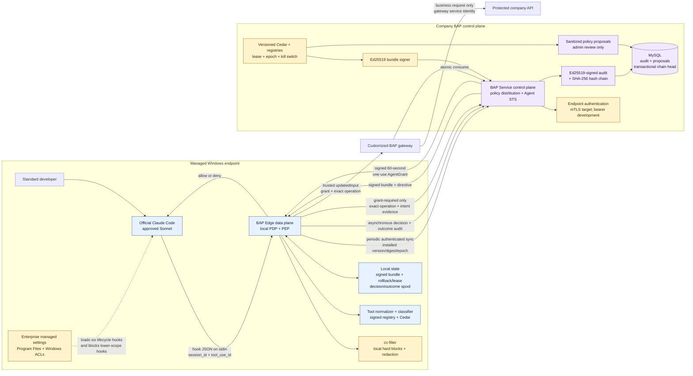

# BAP Edge MVP technical architecture

## Executive decision

BAP Edge is an authorization control for tool calls made by an approved Claude
Code client. The current code is a strong reference implementation and the
foundation of a bounded internal-pilot MVP. It is not yet a general enterprise
authorization platform or a control for every process a developer can run.

The current company target is official Claude Code using the approved Sonnet
model on managed Windows endpoints. The local Qwen launcher is a development
harness only. Authorization remains model-independent so additional models can
be certified later without changing policy semantics.

## Component and trust-boundary diagram

PEP means Policy Enforcement Point. BAP Edge is both the local PDP and PEP: it
decides and enforces intercepted traffic. BAP Service is the control plane and
source of rule truth; it does not decide each tool operation in the hot path.

## Components, functions, and technologies

| Component | Function | Current technology | MVP status |
|---|---|---|---|
| Claude integration | Deterministically invokes BAP around lifecycle and tool events | Claude Code managed command hooks | Implemented; exact Sonnet release certification remains |
| BAP Edge | Local PDP/PEP, normalization, bundle verification, Cedar evaluation, fail-closed enforcement | Static Go 1.23 Windows executable | Signed-bundle baseline implemented |
| cc-filter | Fast local content/path/command blocks and prompt redaction | Embedded YAML rules and Go filtering | Implemented baseline; needs versioned bypass corpus |
| BAP protocol | Policy synchronization, asynchronous audit, and escalated AgentGrant transactions | HTTPS JSON `/bap/v1/edge/sync`, `/bap/v1/agent-sts/issue`, `/bap/v1/agent-sts/consume` | Reference vertical slice implemented; persistent push and durable STS ledger remain |
| Agent STS | Issues exact, short-lived, one-use capabilities only for grant-required operations | Ed25519 AgentGrant plus atomic state transition | In-memory solid example; shared transactional store required for production |
| BAP gateway | Resource-side enforcement before a protected API | Go enforcement reference for a customized Spring Cloud Gateway filter | Request/tamper/replay contract implemented and tested |
| BAP authentication | Rejects unregistered synchronization/audit callers | TLS 1.2+, optional verified mTLS, bearer for development | mTLS transport implemented; enrollment/revocation remains |
| Policy engine | Local permit, explicit forbid, and default deny from central signed policy | Cedar through `cedar-go` inside Edge | Integration implemented; company corpus remains |
| Client/model certification | Privacy-safe schema capture, representative replay, model equivalence, fixture hashes, policy version/digest binding | Edge capture plus `bap-fixture` verifier | Framework implemented; exact company captures remain |
| Policy bundle | Carries immutable central rules to Edge | Ed25519, version/digest/epoch, expiry, refresh/offline lease | Implemented pull baseline |
| Audit | Correlates local decisions, local denies, and outcomes | Durable Edge spool plus MySQL signed/hash chain | Baseline; protected Agent queue/SIEM remains |
| Policy proposals | Captures missing-policy shapes without self-authorizing | Sanitized deduplicated MySQL rows | Durable advisory evidence; governed CRUD/approval API remains |
| Packaging | Separates endpoint data plane from rule control plane | Windows Program Files installation and non-root OCI container | Development deployment implemented; protected Agent/signing/SBOM remains |

## Why retain cc-filter

cc-filter and Cedar solve different parts of the problem and should remain
layered.

cc-filter is useful because it runs locally before a network round trip, can
block known secret paths and risky content patterns immediately, and can redact
prompt material before it leaves the endpoint. It also preserves the security
behavior inherited from the original project. A local denial is final; BAP
Service receives only a sanitized denial record and cannot turn it into an
allow.

Cedar is the local decision layer distributed from the central rule authority.
It reasons over a normalized principal, action, resource, and context while the
signed bundle gives administrators one governed source. Cedar's
authorization semantics are deliberately useful here: a matching `forbid`
overrides any `permit`, and no matching permit results in default deny. See the
[official Cedar authorization model](https://docs.cedarpolicy.com/auth/authorization.html).

cc-filter must not be represented as a complete shell parser, DLP engine, or
enterprise identity control. For the MVP, its patterns need adversarial tests,
while Cedar and protected-resource controls remain authoritative layers.

## How managed settings resist standard-user tampering

The Windows installer puts these administrator-owned artifacts outside the
developer's profile:

- `C:\Program Files\BAP Edge\bap-edge.exe`;
- `C:\Program Files\BAP Edge\bap-edge.yaml`, CA bundle, and grant public key;
- `C:\Program Files\ClaudeCode\managed-settings.d\50-bap-edge.json`.

Windows ACLs give SYSTEM and Administrators control while standard Users receive
read/execute access. Claude's managed tier has higher precedence than user,
project, local, and command-line settings. The installed policy enables
`allowManagedHooksOnly`, `allowManagedPermissionRulesOnly`, disables bypass
permissions mode, and sets a tested client-version floor. Anthropic documents
that managed hooks remain loaded while user/project hooks are blocked and that
managed settings cannot be overridden by lower settings sources in the
[Claude Code settings reference](https://code.claude.com/docs/en/settings).

Together, those controls stop a standard developer from editing the installed
hook command, replacing the managed Edge binary in Program Files, adding a
lower-scope hook that overrides BAP, or enabling Claude's bypass-permissions
mode. `/hooks` may still display `0 hooks configured` because that screen shows
editable hooks, not the managed policy hook registry. The live allow/deny test
is authoritative.

This boundary is not protection against:

- a user with local Administrator rights;
- an unapproved or modified Claude executable;
- a different shell, database client, or API client that never invokes Claude
  hooks;
- direct access to a protected resource; or
- copying a bearer credential visible in the process environment.

The pilot therefore also requires standard-user endpoints, application
allowlisting, approved Claude distribution, and resource-side authorization for
high-value systems. Managed settings are a strong client control, not an
operating-system security boundary by themselves.

## Synchronization and local decision contract

The [OpenID AuthZEN Authorization API 1.0](https://openid.net/specs/authorization-api-1_0.html)
is used as the normalized authorization model. The active traffic path
synchronizes a signed bundle, then evaluates the same
Subject-Action-Resource-Context shape locally:

| SARC field | BAP example | Meaning |
|---|---|---|
| Subject | `agent / claude-code-local` | Logical requester presented to policy |
| Action | `file.read`, `command.execute`, `network.fetch` | Normalized operation, independent of Claude tool spelling |
| Resource | hashed tool invocation plus risk properties | Object/target being authorized without using plaintext as its identity |
| Context | session, workload, tool-use, workspace, asserted user | Environmental and correlation attributes |

The active control-plane/data-plane contract implements:

- `POST /bap/v1/edge/sync` for signed policy and directives;
- local Cedar allow/deny in BAP Edge;
- `POST /bap/v1/audit/edge-decision` and outcome/denial audit extensions.

Escalated gateway operations use the AgentGrant flow documented in
[AgentGrant and Agent STS](agent-grant-sts.md). Ordinary permits do not call
the STS, and local forbids, manual-only decisions, unknown operations, stale
policy, missing intent, and offline issuance all fail closed.

## Tool normalization and Cedar enforcement

Claude models choose tools, but the policy must authorize the resulting
operation rather than trusting model intent or model identity. Current
normalization separates:

- file read, search, and write;
- notebook write;
- command execution;
- web search and arbitrary network fetch;
- MCP invocation;
- agent delegation; and
- unknown tools.

The first MVP hardening slice explicitly forbids protected/outside-workspace
resources, security-control writes, destructive commands, privileged commands,
likely exfiltration, common encoded command forms, arbitrary WebFetch, MCP,
delegation, and unknown tools. Web search and ordinary safe development actions
retain explicit permits. MCP, fetch, and delegation stay denied until governed
registries and policy profiles exist.

Privileged interactive clients use a separate signed `manual-only` command
effect. Claude can prepare the work, but Edge denies execution and tells the
employee to review the command, confirm A2P, and run it in a separate terminal.
The denial does not reproduce command or connection details. This avoids a BAP
proxy or adapter for every database while keeping Claude execution fail-closed.
Explicit forbids take precedence over manual-only rules. See the [manual
execution boundary](manual-execution-boundary.md).

Signed `UserPromptSubmit` rules provide an earlier, advisory signal when normal
language combines an operation such as connect, execute, reindex, deploy, or
SSH access with a governed resource family. The inherited cc-filter still runs
first. A match adds local context asking Claude to prepare a manual handoff; it
does not rewrite the prompt, contact the control plane with prompt text, or
grant authority. The eventual structured tool call remains the only
authorization input.

The command classifier uses a deliberately limited direct-executable parser and
anchored argument rules. Shell operators, substitutions, encoded launchers, and
ambiguous syntax fail closed. Versioned approved-model fixtures and the bypass
corpus certify the supported contract. The detailed work is in the [Cedar MVP
policy plan](cedar-mvp-policy-plan.md).

## Identity and end-to-end correlation

Several identifiers have distinct purposes and must not be conflated:

| Identifier | Current source | Current assurance | MVP target |
|---|---|---|---|
| Claude `session_id` | Claude hook input | Correlates one Claude session | Retain; validate against supported hook contract |
| BAP `workload_id` | Random `bapw_...` generated by Edge per session | Stable correlation label stored in the user's state directory | Bind to an authenticated device/workload identity |
| Claude `tool_use_id` | Claude hook input | Correlates pre-tool authorization with post-tool outcome | Retain and validate uniqueness/format |
| Edge instance ID | Edge persistent state | Identifies one synchronization client; not attestation | Bind to enrolled mTLS/attested device |
| HTTP `X-Request-ID` | Edge generates per HTTP request | Correlates sync/audit calls | Propagate one W3C trace across Edge, control plane, audit, and dependencies |
| bundle version/digest/epoch | Signed control-plane bundle | Identifies exactly which rules made a local decision | Retain with rollout history |
| credential fingerprint | Verified certificate or development bearer hash | Identifies which endpoint delivered sync/audit | Registered revocable device identity |

The workload ID is therefore **implemented as correlation**, but **verified
workload identity is not implemented**. Edge creates a cryptographically random
ID, persists the Claude-session-to-workload mapping, sends it in AuthZEN context,
and records it in authorization/outcome audit events. The service does not
register, attest, revoke, or cryptographically authenticate that workload ID;
a client holding the bearer key can assert another value. Calling the current
value an enterprise workload identity would overstate its security.

End-to-end business correlation exists through session/workload/tool-use and
decision IDs. Full distributed tracing does not: there is no W3C `traceparent`,
span model, or trace backend yet.

## Endpoint authentication

`BAP_EDGE_API_KEY` is a local-development compatibility credential. It is not an
Anthropic key. The pilot target is a unique verified mTLS device certificate.

Authentication is used to:

1. reject unauthorized policy synchronization and audit callers;
2. map the verified certificate to an endpoint principal;
3. bind rollout, revocation, and audit to that endpoint; and
4. record a certificate or bearer fingerprint without storing the secret.

The Edge sends it only in `Authorization: Bearer ...` over HTTPS. The service
uses constant-time comparison. The installer stores the value in the Windows
machine environment so the managed Claude process can pass it to Edge; the
configured YAML stores only the environment-variable name.

The current key is authentication, not fine-grained authorization and not proof
of a particular human or healthy device. A standard user can normally inspect
their own inherited process environment and copy it. The service currently has
one configured key/principal per instance and lacks registration, individual
revocation, rotation overlap, expiry, and device attestation.

The transport accepts mTLS when BAP Service is configured with
`BAP_CLIENT_CA_PATH`; Edge supplies the configured certificate/key. Enrollment,
revocation, rotation, TPM-backed non-exportable keys, and attestation remain MVP
work. API keys must not be the company identity boundary.

## Bundle and local-state security

The dedicated Ed25519 bundle signature proves that the control plane issued the
exact Cedar and registry content. Edge verifies schema, signature, expiry,
version, digest, revocation epoch, minimum protocol, and lease before use.
Lower versions/epochs are rollback; different content under the same version is
equivocation. Deleting state forces synchronization and never creates an allow.

The 30-day value is a maximum rule/bundle approval lifetime. Normal refresh is
15 minutes and the development maximum-offline lease is one hour. There is no
reusable 30-day tool authorization grant.

## Audit data and privacy boundary

BAP captures structured authorization intent: normalized action, tool name,
resource identifier, risk flags, policy version, reason code, decision, and the
correlation identifiers above. It also correlates success/failure outcomes to a
prior allowed operation.

It intentionally does not persist prompts, tool output, error text, file
contents, secrets, or plaintext shell commands in central audit. Commands and
outside-workspace targets are represented by hashes; in-workspace file targets
are stored as relative summaries. cc-filter necessarily sees the incoming hook
payload locally to evaluate/redact it, but its central denial event is
sanitized.

Current MySQL audit appends are transactional, individually Ed25519-signed, and
SHA-256 hash-chained through a locked chain-head row. This makes tampering
detectable and permits indexed correlation, but a local single database is not
highly available or externally immutable. The MVP needs managed replication,
retention/access policy, restore testing, SIEM export, alerts, and an external
checkpoint.

## API surface: current and MVP target

| Method and path | Authentication | Purpose | State |
|---|---|---|---|
| `GET /healthz` | None | Process liveness | Implemented |
| `GET /readyz` | None | MySQL-backed service readiness | Implemented and outage-tested |
| `GET /.well-known/authzen-configuration` | None | PDP discovery | Implemented |
| `POST /bap/v1/edge/sync` | Edge mTLS or development bearer | Signed bundle and update/kill directive | Implemented |
| `POST /bap/v1/audit/edge-decision` | Edge mTLS or development bearer | Ingest locally made decision | Implemented |
| `POST /bap/v1/audit/outcome` | Edge mTLS or development bearer | Record correlated success/failure | Implemented |
| `POST /bap/v1/audit/edge-denial` | Edge mTLS or development bearer | Record sanitized local-filter denial | Implemented |
| `POST /access/v1/evaluation`, grant consumption | Development bearer | Legacy migration compatibility | Implemented; not active Edge path |
| policy/proposal CRUD and approval | Admin identity | Govern proposal, validate, approve, deploy, rollback | MVP requirement |
| audit/decision read API | Admin/auditor identity | Search timelines without file access | MVP requirement |
| identity registration/revocation | Admin identity | Manage endpoint credentials/workload identities | MVP requirement |
| metrics/readiness | Operations identity/network control | SLOs, alerts, dependency readiness | MVP requirement |

Administrative CRUD must not reuse the Edge API key. It needs separate
administrator/auditor authentication, role checks, immutable audit, validation,
and two-person approval for sensitive policy changes. The operations UI should
consume these APIs only after their authorization model exists.

## MVP security claim and remaining blockers

The defensible pilot claim is:

> On managed, standard-user Windows endpoints, approved Claude Code tool calls
> are intercepted by administrator-controlled hooks, decided and enforced by
> BAP Edge from centrally signed rules and local Cedar default deny, and
> asynchronously correlated in tamper-evident central audit.

Do not claim that BAP controls every process on the workstation, prevents a
local administrator, or protects a database that remains directly reachable.

The P0 blockers are:

1. certify exact Claude Code, Sonnet, built-in tool, MCP, and delegation
   contracts;
2. finish registry-backed network/MCP policy and parsed shell classification;
3. replace the shared bearer model with per-endpoint revocable identity;
4. add W3C tracing, metrics, dependency readiness, and privacy/failure tests;
5. provide governed policy lifecycle and authenticated admin/read APIs;
6. operationalize durable audit, backup, SIEM, signing, SBOM, and release
   controls.

Track the sequence and release gates in the [MVP roadmap](mvp-roadmap.md).
