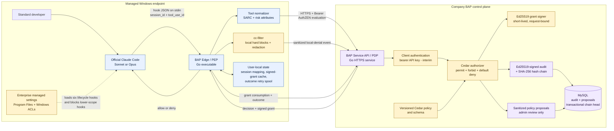

# BAP Edge MVP technical architecture

## Executive decision

BAP Edge is an authorization control for tool calls made by an approved Claude
Code client. The current code is a strong reference implementation and the
foundation of a bounded internal-pilot MVP. It is not yet a general enterprise
authorization platform or a control for every process a developer can run.

The company target is official Claude Code using approved Sonnet and Opus
models on managed Windows endpoints. The local Qwen launcher is a development
harness only. Authorization is model-independent: equivalent normalized tool
operations must receive the same decision whether Sonnet or Opus requested
them.

## Component and trust-boundary diagram

PEP means Policy Enforcement Point: BAP Edge is where an allow or deny is
enforced before Claude executes a tool. PDP means Policy Decision Point: BAP
Service evaluates centrally managed authorization policy.

## Components, functions, and technologies

| Component | Function | Current technology | MVP status |
|---|---|---|---|
| Claude integration | Deterministically invokes BAP around lifecycle and tool events | Claude Code managed command hooks | Implemented; exact Sonnet/Opus release certification remains |
| BAP Edge | Local PEP, fail-closed decision handling, normalization, grant verification | Static Go 1.23 Windows executable | Implemented baseline |
| cc-filter | Fast local content/path/command blocks and prompt redaction | Embedded YAML rules and Go filtering | Implemented baseline; needs versioned bypass corpus |
| BAP protocol | Vendor-neutral PEP-to-PDP authorization request | HTTPS JSON aligned to OpenID AuthZEN Authorization API 1.0 SARC | Core evaluation implemented; not conformance-certified |
| BAP authentication | Rejects callers without an Edge credential | TLS 1.2+ plus bearer `BAP_EDGE_API_KEY` | Interim; replace with per-device mTLS or short-lived enterprise identity |
| Policy engine | Central permit, explicit forbid, and default deny | Cedar through `cedar-go` | Integration implemented; company policy corpus and profiles remain |
| Grant | Proves a specific allow decision to Edge | Ed25519 `BAP-Grant-EdDSA`, complete-request hash, short TTL | Implemented |
| Grant cache | Avoids repeat Cedar evaluation for an exact retry | User-local files keyed by SHA-256 request hash | Implemented; each hit still needs central audit acknowledgement |
| Audit | Correlates decisions, cache use, local denies, and outcomes | MySQL transaction, locked chain head, Ed25519 signature, SHA-256 hash chain | Pilot database baseline; managed replication/backup/SIEM remains |
| Policy proposals | Captures missing-policy shapes without self-authorizing | Sanitized deduplicated MySQL rows | Durable advisory evidence; governed CRUD/approval API remains |
| Packaging | Separates endpoint PEP from network PDP | Windows Program Files installation and non-root OCI container | Implemented development deployment; signing/SBOM/HA remains |

## Why retain cc-filter

cc-filter and Cedar solve different parts of the problem and should remain
layered.

cc-filter is useful because it runs locally before a network round trip, can
block known secret paths and risky content patterns immediately, and can redact
prompt material before it leaves the endpoint. It also preserves the security
behavior inherited from the original project. A local denial is final; BAP
Service receives only a sanitized denial record and cannot turn it into an
allow.

Cedar is the central authorization layer. It reasons over a normalized
principal, action, resource, and context, gives administrators one governed
policy location, and provides consistent decisions across endpoints. Cedar's
authorization semantics are deliberately useful here: a matching `forbid`
overrides any `permit`, and no matching permit results in default deny. See the
[official Cedar authorization model](https://docs.cedarpolicy.com/auth/authorization.html).

cc-filter must not be represented as a complete shell parser, DLP engine, or
enterprise identity control. For the MVP, its patterns need adversarial tests,
while Cedar and protected-resource controls remain authoritative layers.

## How managed settings resist standard-user tampering

The Windows installer puts these administrator-owned artifacts outside the
developer's profile:

- `C:\Program Files\BAP Edge\bap-edge.exe`;
- `C:\Program Files\BAP Edge\bap-edge.yaml`, CA bundle, and grant public key;
- `C:\Program Files\ClaudeCode\managed-settings.d\50-bap-edge.json`.

Windows ACLs give SYSTEM and Administrators control while standard Users receive
read/execute access. Claude's managed tier has higher precedence than user,
project, local, and command-line settings. The installed policy enables
`allowManagedHooksOnly`, `allowManagedPermissionRulesOnly`, disables bypass
permissions mode, and sets a tested client-version floor. Anthropic documents
that managed hooks remain loaded while user/project hooks are blocked and that
managed settings cannot be overridden by lower settings sources in the
[Claude Code settings reference](https://code.claude.com/docs/en/settings).

Together, those controls stop a standard developer from editing the installed
hook command, replacing the managed Edge binary in Program Files, adding a
lower-scope hook that overrides BAP, or enabling Claude's bypass-permissions
mode. `/hooks` may still display `0 hooks configured` because that screen shows
editable hooks, not the managed policy hook registry. The live allow/deny test
is authoritative.

This boundary is not protection against:

- a user with local Administrator rights;
- an unapproved or modified Claude executable;
- a different shell, database client, or API client that never invokes Claude
  hooks;
- direct access to a protected resource; or
- copying a bearer credential visible in the process environment.

The pilot therefore also requires standard-user endpoints, application
allowlisting, approved Claude distribution, and resource-side authorization for
high-value systems. Managed settings are a strong client control, not an
operating-system security boundary by themselves.

## Authorization request and decision contract

The [OpenID AuthZEN Authorization API 1.0](https://openid.net/specs/authorization-api-1_0.html)
is a Final Specification as of January 2026. It defines communication between a
PEP and PDP without coupling either side to the other's internal policy engine.
BAP uses its Subject-Action-Resource-Context model:

| SARC field | BAP example | Meaning |
|---|---|---|
| Subject | `agent / claude-code-local` | Logical requester presented to policy |
| Action | `file.read`, `command.execute`, `network.fetch` | Normalized operation, independent of Claude tool spelling |
| Resource | hashed tool invocation plus risk properties | Object/target being authorized without using plaintext as its identity |
| Context | session, workload, tool-use, workspace, asserted user | Environmental and correlation attributes |

The service implements:

- `GET /.well-known/authzen-configuration` for discovery;
- `POST /access/v1/evaluation` for one authorization decision;
- the AuthZEN `decision` Boolean and `context` response shape.

BAP-specific fields such as `decision_id`, `reason_code`, `policy_version`,
signed grant, expiry, and proposal status are returned in AuthZEN `context`.
The audit-consumption, outcome, and local-denial endpoints are BAP extensions,
not AuthZEN endpoints. The implementation is aligned to the core API shape but
has not yet passed an external AuthZEN conformance suite; that is an MVP gate.

## Tool normalization and Cedar enforcement

Claude models choose tools, but the policy must authorize the resulting
operation rather than trusting model intent or model identity. Current
normalization separates:

- file read, search, and write;
- notebook write;
- command execution;
- web search and arbitrary network fetch;
- MCP invocation;
- agent delegation; and
- unknown tools.

The first MVP hardening slice explicitly forbids protected/outside-workspace
resources, security-control writes, destructive commands, privileged commands,
likely exfiltration, common encoded command forms, arbitrary WebFetch, MCP,
delegation, and unknown tools. Web search and ordinary safe development actions
retain explicit permits. MCP, fetch, and delegation stay denied until governed
registries and policy profiles exist.

The current command classifier is still regex-based. A shell-aware parser,
executable/argument model, versioned Sonnet/Opus fixtures, and bypass corpus are
required before the policy can be called MVP-complete. The detailed work is in
the [Cedar MVP policy plan](cedar-mvp-policy-plan.md).

## Identity and end-to-end correlation

Several identifiers have distinct purposes and must not be conflated:

| Identifier | Current source | Current assurance | MVP target |
|---|---|---|---|
| Claude `session_id` | Claude hook input | Correlates one Claude session | Retain; validate against supported hook contract |
| BAP `workload_id` | Random `bapw_...` generated by Edge per session | Stable correlation label stored in the user's state directory | Bind to an authenticated device/workload identity |
| Claude `tool_use_id` | Claude hook input | Correlates pre-tool authorization with post-tool outcome | Retain and validate uniqueness/format |
| HTTP `X-Request-ID` | Edge generates per HTTP request | Correlates one network call and response | Propagate one W3C trace across Edge, PDP, audit, and dependencies |
| `decision_id` | BAP Service | Identifies a PDP decision and signed grant | Retain |
| credential fingerprint | SHA-256 of the presented BAP API key | Identifies which bearer credential called the PDP | Replace/augment with registered device/workload identity |

The workload ID is therefore **implemented as correlation**, but **verified
workload identity is not implemented**. Edge creates a cryptographically random
ID, persists the Claude-session-to-workload mapping, sends it in AuthZEN context,
and records it in authorization/outcome audit events. The service does not
register, attest, revoke, or cryptographically authenticate that workload ID;
a client holding the bearer key can assert another value. Calling the current
value an enterprise workload identity would overstate its security.

End-to-end business correlation exists through session/workload/tool-use and
decision IDs. Full distributed tracing does not: there is no W3C `traceparent`,
span model, or trace backend yet.

## Why BAP has a separate API key

`BAP_EDGE_API_KEY` is not an Anthropic key and does not call Sonnet or Opus. It
authenticates BAP Edge to BAP Service.

It is useful today for four reasons:

1. Requests without the credential receive HTTP 401 instead of reaching Cedar.
2. The service maps an accepted credential to a configured BAP principal.
3. Audit records contain the principal and a SHA-256 credential fingerprint,
   never the plaintext key.
4. Signed grants carry that principal/fingerprint binding, and cached-grant
   consumption must present the same credential.

The Edge sends it only in `Authorization: Bearer ...` over HTTPS. The service
uses constant-time comparison. The installer stores the value in the Windows
machine environment so the managed Claude process can pass it to Edge; the
configured YAML stores only the environment-variable name.

The current key is authentication, not fine-grained authorization and not proof
of a particular human or healthy device. A standard user can normally inspect
their own inherited process environment and copy it. The service currently has
one configured key/principal per instance and lacks registration, individual
revocation, rotation overlap, expiry, and device attestation.

For the pilot, issue at least one independently revocable credential per
endpoint and maintain a protected registry. The preferred final design is mTLS
with company-issued device certificates or short-lived enterprise workload
tokens whose claims are mapped into Cedar principal attributes. API keys may
remain as a bootstrap or development mechanism, but not as the final identity
boundary.

## Grant and cache security

The API key proves who may call BAP Service; the signed grant proves what exact
operation BAP Service allowed. They are intentionally separate.

For an allow, the PDP signs an Ed25519 grant containing issuer, audience,
subject, action, resource, Claude session, complete AuthZEN request hash,
decision ID, caller principal/fingerprint, policy version, issue time, and
expiry. Edge verifies the signature, audience, request hash, and expiry before
allowing Claude.

The local cache stores only these signed allow grants. A different path,
command, session, workload, tool-use ID, or context changes the request hash and
misses the cache. Even an exact cache hit is not an offline allow: BAP Service
must re-verify it and durably record grant consumption. If that acknowledgement
fails, Edge does not authorize from cache.

## Audit data and privacy boundary

BAP captures structured authorization intent: normalized action, tool name,
resource identifier, risk flags, policy version, reason code, decision, and the
correlation identifiers above. It also correlates success/failure outcomes to a
prior allowed operation.

It intentionally does not persist prompts, tool output, error text, file
contents, secrets, or plaintext shell commands in central audit. Commands and
outside-workspace targets are represented by hashes; in-workspace file targets
are stored as relative summaries. cc-filter necessarily sees the incoming hook
payload locally to evaluate/redact it, but its central denial event is
sanitized.

Current MySQL audit appends are transactional, individually Ed25519-signed, and
SHA-256 hash-chained through a locked chain-head row. This makes tampering
detectable and permits indexed correlation, but a local single database is not
highly available or externally immutable. The MVP needs managed replication,
retention/access policy, restore testing, SIEM export, alerts, and an external
checkpoint.

## API surface: current and MVP target

| Method and path | Authentication | Purpose | State |
|---|---|---|---|
| `GET /healthz` | None | Process liveness | Implemented |
| `GET /readyz` | None | MySQL-backed service readiness | Implemented and outage-tested |
| `GET /.well-known/authzen-configuration` | None | PDP discovery | Implemented |
| `POST /access/v1/evaluation` | BAP bearer | AuthZEN decision and optional signed grant | Implemented |
| `POST /bap/v1/audit/grant-consumption` | BAP bearer | Verify and audit exact cached grant use | Implemented |
| `POST /bap/v1/audit/outcome` | BAP bearer | Record correlated success/failure | Implemented |
| `POST /bap/v1/audit/edge-denial` | BAP bearer | Record sanitized local denial | Implemented |
| policy/proposal CRUD and approval | Admin identity | Govern proposal, validate, approve, deploy, rollback | MVP requirement |
| audit/decision read API | Admin/auditor identity | Search timelines without file access | MVP requirement |
| identity registration/revocation | Admin identity | Manage endpoint credentials/workload identities | MVP requirement |
| metrics/readiness | Operations identity/network control | SLOs, alerts, dependency readiness | MVP requirement |

Administrative CRUD must not reuse the Edge API key. It needs separate
administrator/auditor authentication, role checks, immutable audit, validation,
and two-person approval for sensitive policy changes. The operations UI should
consume these APIs only after their authorization model exists.

## MVP security claim and remaining blockers

The defensible pilot claim is:

> On managed, standard-user Windows endpoints, approved Claude Code tool calls
> are intercepted by administrator-controlled hooks, locally screened,
> centrally authorized with Cedar over AuthZEN, denied by default, and
> correlated in tamper-evident audit.

Do not claim that BAP controls every process on the workstation, prevents a
local administrator, or protects a database that remains directly reachable.

The P0 blockers are:

1. certify exact Claude Code, Sonnet, Opus, built-in tool, MCP, and delegation
   contracts;
2. finish registry-backed network/MCP policy and parsed shell classification;
3. replace the shared bearer model with per-endpoint revocable identity;
4. add W3C tracing, metrics, dependency readiness, and privacy/failure tests;
5. provide governed policy lifecycle and authenticated admin/read APIs;
6. operationalize durable audit, backup, SIEM, signing, SBOM, and release
   controls.

Track the sequence and release gates in the [MVP roadmap](mvp-roadmap.md).
