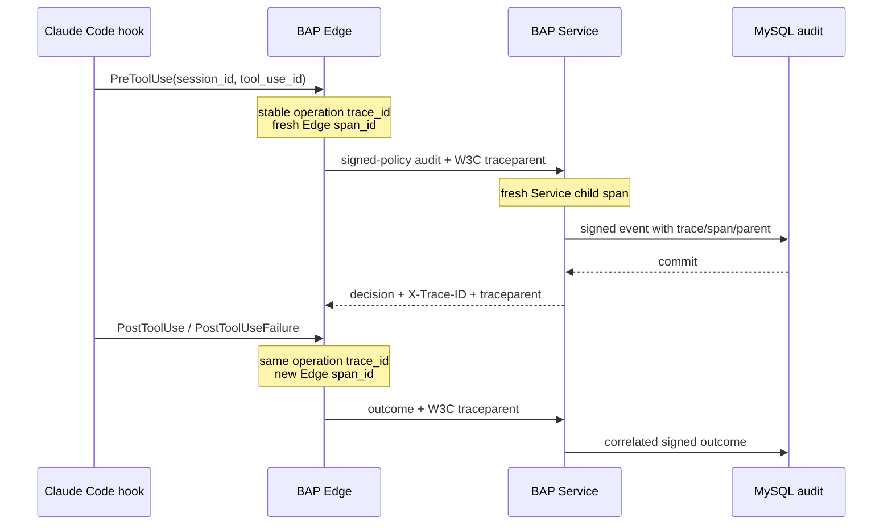

# End-to-end observability

BAP owns an operation trace from the Claude hook boundary through BAP Edge,
local Cedar, the signed MySQL audit commit, AgentGrant use, and the final
tool outcome. This works without access to Claude's private model reasoning or
internal spans.



## Trace semantics

- `trace_id` is stable for one `(session_id, workload_id, tool_use_id)` operation
  across separate Claude hook processes and retry-spool delivery.
- Each Edge hook process creates a fresh `span_id`.
- Every BAP Service request accepts a valid W3C `traceparent`, creates a child
  span, and returns `traceparent` plus `X-Trace-ID`.
- Signed audit events persist `trace_id`, Service `span_id`, and
  `parent_span_id`. MySQL indexes trace ID and timestamp.
- Requests without valid trace context receive a new Service root trace.

Trace IDs are correlation identifiers, not authentication or authorization
claims. The API credential and Cedar decision remain authoritative.

## Privacy boundary

Operational logs and metrics never include prompt text, model output, tool
input, command text, file contents, paths, API keys, grants, or database
credentials. The Edge JSONL schema is fixed to timestamp, level, event,
trace/span, hook phase, tool/action class, decision, reason code, and source.
Prometheus labels are bounded enums rather than user-controlled identifiers.

The signed audit record retains the existing privacy-safe target summary: a
workspace-relative file name where allowed, or a hash for commands and outside
paths. Audit is security evidence; ordinary logs and metrics are operational
telemetry.

## View local Edge logs

Managed Windows installation with an empty `state_directory` uses:

```text
%LOCALAPPDATA%\BAP Edge\observability\edge.jsonl
```

The automated acceptance configuration uses:

```text
.bap\runtime\<engine>\test-edge-state\observability\edge.jsonl
```

Edge keeps the active file below 10 MiB and retains one local `.1` rotation.
Company log agents should collect it before rotation; the signed MySQL audit is
the durable security record.

Example:

```powershell
Get-Content "$env:LOCALAPPDATA\BAP Edge\observability\edge.jsonl" -Tail 20 |
  ForEach-Object { $_ | ConvertFrom-Json } |
  Format-Table timestamp,event,trace_id,hook_event,tool,action,decision,reason_code
```

## View Service logs and metrics

For one live, labeled view of both components in any supported runtime:

```powershell
.\Watch-BapLogs.ps1 -Runtime Native -Component All -Tail 100
.\Watch-BapLogs.ps1 -Runtime Docker -Component All -Tail 100
.\Watch-BapLogs.ps1 -Runtime Podman -Component All -Tail 100
```

Use `-Component Edge` or `-Component Service` to narrow it, `-NoFollow` for a
one-time snapshot, and Ctrl+C to stop. Native mode follows the latest retained
run's Service stdout/stderr and Edge JSONL. Container mode follows
`bap-service-local` plus the host-side test Edge JSONL.

For a single read-only posture summary across the control plane and every local
Edge state discovered on the workstation:

```powershell
.\Show-BapStatus.ps1 -Runtime Docker
```

It shows policy/digest agreement, expiry, last synchronization, refresh and
offline-lease time, kill switch, queued audit count, Edge instance ID, Service
readiness, MySQL container state, and Claude fixture/manifest count. It reads
state only and does not synchronize or modify policy.

```powershell
docker logs --tail 100 bap-service-local

curl.exe --ssl-no-revoke `
  --cacert .\.bap\runtime\docker\dev-ca.pem `
  https://127.0.0.1:8443/metrics
```

Substitute Podman and `.bap/runtime/podman` when applicable. Decision-path logs
are JSON and distinguish `authorization_committed` from policy evaluation or
`audit_write_error`; an allow is not logged as committed before MySQL commits.

Current bounded metrics include:

- `bap_service_ready`;
- `bap_authorization_decisions_total` by decision, reason code, and source;
- `bap_authentication_failures_total`;
- `bap_audit_failures_total` by operation class;
- `bap_tool_outcomes_total` by success/failure;
- `bap_http_request_duration_seconds` by known route, method, and status.

Each Edge state directory also contains an atomically updated Prometheus
textfile at `observability/edge.prom` with:

- `bap_edge_audit_spool_depth`;
- `bap_edge_audit_spool_bytes`;
- `bap_edge_audit_spool_oldest_age_seconds`.

These gauges contain no tool names, paths, prompts, identifiers, or event
payloads. `Show-BapStatus.ps1` displays the same queue depth, byte count, and
oldest age for every discovered Edge state. The spool rejects new events at
10,000 entries or 64 MiB without deleting existing evidence; an authorization
that cannot first durably spool its local decision fails closed.

Protect `/metrics` with a network policy or monitoring proxy in the company
environment. It contains no credentials or high-cardinality identifiers, but it
still reveals service security posture.

## Follow one trace through signed audit

```powershell
$traceId = 'REPLACE_WITH_TRACE_ID'
$events = docker exec bap-service-local bap-service audit list | ConvertFrom-Json
$events |
  Where-Object trace_id -eq $traceId |
  Sort-Object timestamp |
  Select-Object timestamp,event_type,source,trace_id,span_id,parent_span_id,action,tool,allowed,reason_code,outcome |
  Format-Table
```

The authorization, centrally acknowledged cache consumption, and tool outcome
for one tool-use ID share the same trace ID while using distinct spans.

## Company integration and remaining work

Scrape `/metrics` with the company Prometheus-compatible collector, ingest
Service stdout JSON and endpoint Edge JSONL through approved log agents, and
index signed audit events for investigation. Alert on readiness zero,
authentication/audit failures, deny-rate anomalies, latency SLO violations, and
old outcome-spool entries.

W3C propagation, span persistence, and Edge spool textfile metrics are
implemented. Direct OTLP export to an OpenTelemetry Collector, trace sampling
controls, collector wiring, and a central trace UI remain future work. Claude's
hidden chain-of-thought and provider-internal execution are intentionally
outside BAP's telemetry boundary.
