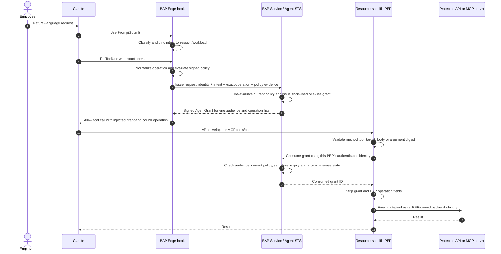
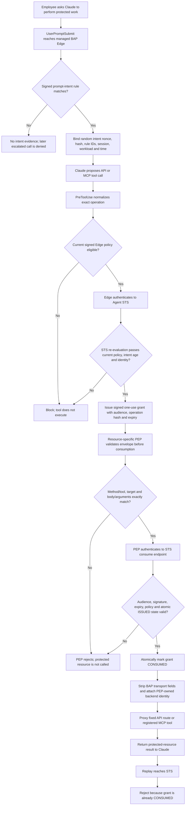

# Resource PEPs: API and MCP

For production configuration use the [deployment guide](deployment-guide.md).
For exact automated and human verification use the
[protected-resource acceptance guide](protected-resource-acceptance.md).

BAP Edge does not execute a protected operation merely because local policy
matched. It obtains a short-lived, one-use AgentGrant from Agent STS. The PEP
at the resource boundary consumes that exact grant, removes BAP transport
fields, substitutes its own backend identity, and only then proxies the call.

The runnable reference implementations are:

- `bap-api-gateway-springcloud`: Java 21 Spring Cloud Gateway API PEP;
- `bap-mcp-pep`: Go MCP PEP;
- `examples/protected-resources`: mock protected API and MCP upstream used only
  by tests and demonstrations.

## Complete transaction



The API PEP has one fixed public route in the MVP. It does not accept an
arbitrary backend URL. The MCP PEP exposes only configured tools and validates
required and exact arguments. Each PEP has a distinct Agent STS credential and
audience; the wrong PEP cannot consume or burn another PEP's grant.

## Enforcement activity and failure paths



## Company-native prerequisites

For a container-free Windows company laptop install or use approved versions
of:

- Go 1.23.12 or newer;
- Java 21;
- Maven 3.9 or newer.

No Docker or Podman is required for native build, test, or demo. The Spring
component produces a JAR; the Go components produce Windows EXEs. Go on Windows
can also cross-compile the Go MCP PEP for Linux, but the Java gateway uses the
same platform-independent JAR on Windows and Linux.

## Build

Run all commands from the repository root.

```powershell
# Company Windows/native artifacts
.\Build-ResourcePEPs.ps1 -Runtime Native

# Native Go MCP PEP for both Windows and Linux AMD64, plus the gateway JAR
.\Build-ResourcePEPs.ps1 -Runtime Native -Target All -Architecture amd64

# OCI images
.\Build-ResourcePEPs.ps1 -Runtime Docker
.\Build-ResourcePEPs.ps1 -Runtime Podman
```

Native outputs:

```text
dist/bap-mcp-pep-windows-amd64.exe
dist/bap-mcp-pep-linux-amd64
dist/bap-mock-resources-windows-amd64.exe
dist/bap-api-gateway-springcloud.jar
```

## Test

```powershell
.\Test-ResourcePEPs.ps1 -Runtime Native
.\Test-ResourcePEPs.ps1 -Runtime Docker
.\Test-ResourcePEPs.ps1 -Runtime Podman
```

Native tests cover exact operation binding, argument/body tamper rejection,
one-use AgentGrant consumption, audience isolation, transport stripping, and
PEP-owned upstream identities. Docker and Podman run tests while building both
images.

## One-command end-to-end proof

This is the recommended company-native acceptance test:

```powershell
.\Demo-ResourcePEPs.ps1 -Runtime Native -Rebuild
```

Container PEP variants still run BAP Service, BAP Edge, and mock resources as
native test processes, while the two PEPs run in the selected container engine:

```powershell
.\Demo-ResourcePEPs.ps1 -Runtime Docker -Rebuild
.\Demo-ResourcePEPs.ps1 -Runtime Podman -Rebuild
```

A successful run prints PASS lines for both complete paths, rejects replay for
both grants, proves direct backend access is rejected, proves each resource ran
exactly once, and retains evidence under `.bap/resource-pep-demo/`.

## Start against real development resources

Use process-scoped secrets. The PEP credentials authenticate to Agent STS; the
backend credentials belong only to the corresponding PEP.

```powershell
$env:BAP_API_PEP_STS_API_KEY = '<api-pep-to-sts-secret>'
$env:BAP_MCP_PEP_STS_API_KEY = '<mcp-pep-to-sts-secret>'
$env:BAP_ORDERS_BACKEND_API_KEY = '<api-pep-to-orders-secret>'
$env:BAP_MCP_UPSTREAM_API_KEY = '<mcp-pep-to-upstream-secret>'

.\Start-ResourcePEPs.ps1 -Runtime Native `
  -AgentSTSURL 'https://127.0.0.1:8443' `
  -AgentSTSCAPath '.\.bap\native-local\service-state\dev-ca.pem' `
  -OrdersBackendURL 'https://orders-dev.company.example' `
  -MCPUpstreamURL 'https://mcp-dev.company.example/mcp'

.\Stop-ResourcePEPs.ps1
```

Replace `Native` with `Docker` or `Podman` for a container start. The BAP
Service must configure matching consumers, for example:

```powershell
$env:BAP_AGENT_STS_CONSUMERS_JSON = '[{"principal":"api-pep","api_key_env":"BAP_API_PEP_STS_API_KEY","audiences":["https://api.staging.company.example/orders/deploy"]},{"principal":"mcp-pep","api_key_env":"BAP_MCP_PEP_STS_API_KEY","audiences":["https://bap-mcp-pep.company.example/mcp"]}]'
$env:BAP_API_PEP_RESOURCE = 'https://api.staging.company.example/orders/deploy'
```

Production should source secrets from the approved workload identity or secret
manager rather than literal shell values, use TLS for every STS/backend hop,
and configure the implemented shared transactional MySQL grant/intent ledger
before running multiple Service replicas. The in-memory ledger is native/local
development only.

This reference is not yet COAZ-MCP Binding 1.0 conformant. The exact standards
status and missing requirements are documented in the acceptance guide.
